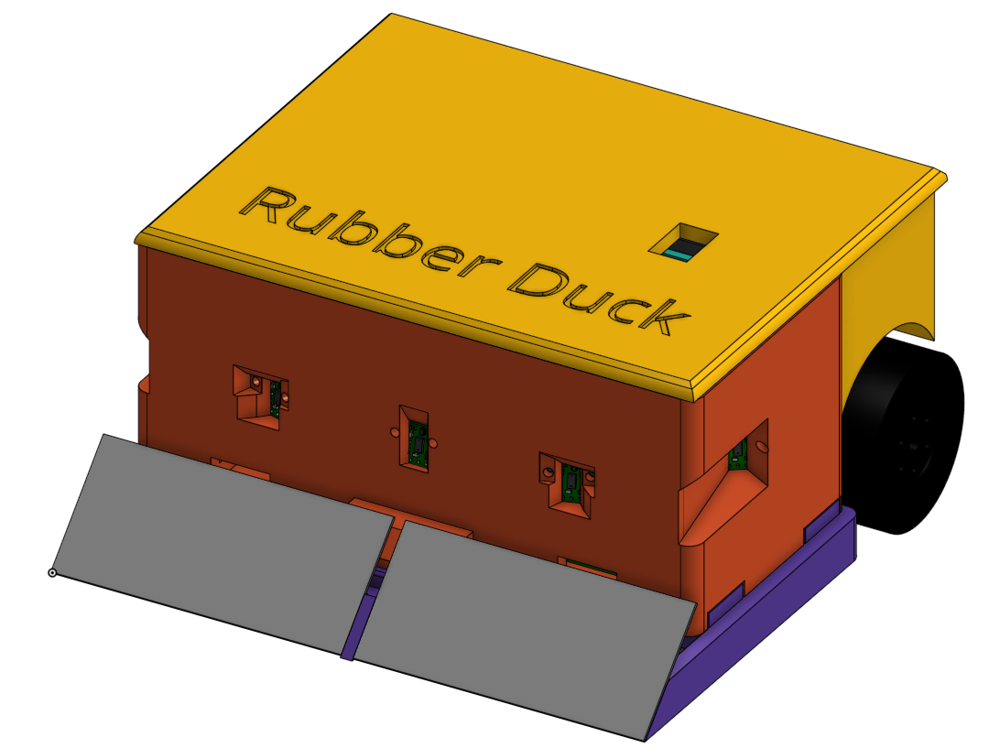

# 🦆 Rubber Duck Sumo Robot




> **IEEE Sumo Bot Competition 2025**  
> *Team Rubber Duck – The only CEGEP team in the competition!*

---

## 🚀 Overview

Rubber Duck is a fully autonomous sumo robot designed and built by three CEGEP students for the 2025 IEEE Sumo Bot Competition. Despite being the youngest team in the event, we engineered a robust, modular, and high-performance robot that combines advanced sensor fusion, real-time control, and professional-grade hardware and software practices.

---

## 🏆 Highlights

- **Youngest Team:** Only CEGEP students in a field of university competitors.
- **Full Custom Design:** All mechanical, electrical, and software systems designed from scratch.
- **Robust I2C Sensor Array:** Five VL53L4CD time-of-flight sensors with advanced error recovery.
- **Edge Detection:** Four QTR reflectance sensors for reliable ring boundary detection.
- **Powerful Drive:** Dual VNH5019 motor driver for high-torque, precise control.
- **Professional Engineering Practices:** Modular C++ code, hardware best practices, and extensive documentation.
- **Test Modes & Diagnostics:** Built-in test modes for every subsystem, including I2C scanning and recovery.
- **Hand-Wired Construction:** All components were connected using careful hand-wiring and wire connectors, with special attention to cable management and signal integrity for reliability under competition conditions.

---

## 🛠️ Features

- **Opponent Detection:** 5x VL53L4CD ToF sensors for 180° coverage, with dynamic address assignment and robust I2C recovery.
- **Edge Avoidance:** 4x QTR reflectance sensors for fast, reliable detection of the ring edge.
- **Motor Control:** Dual VNH5019 driver, PID-based tracking, and strategic speed control for aggressive and defensive maneuvers.
- **Modular Software:** Object-oriented C++ with clear separation of hardware abstraction, control logic, and test utilities.
- **Hardware Reliability:** Strong I2C pull-ups, decoupling capacitors, and noise suppression for competition-grade reliability.
- **Diagnostics:** Onboard test modes for each subsystem, I2C bus scanning, and real-time error recovery.
- **Careful Wiring:** All connections were made with high-quality wires and connectors, with short, tidy runs and robust strain relief to ensure reliability and easy troubleshooting.

---

## 🖼️ Gallery

| External View | Internal View |
|:-------------:|:-------------:|
|  |  |

[CAD FILES ON ONSHAPE](https://cad.onshape.com/documents/050eef38c74bd189d31de6ac/w/3ddb1ddf738198e34fb42bb3/e/f3cbb5a38dd3fbbc7911a3e5?renderMode=0&uiState=682930dae67b445e7527c9dd)
---

## 📦 Project Structure

```
/src
  main.cpp         # Main control software (modular, well-commented)
  ...
/images
  robot_render_front.png
  robot_render_internal.png
README.md
```


---

## 👨‍💻 Software Architecture

Our software is designed for **robustness, modularity, and maintainability**, using modern C++ and object-oriented principles. The main control logic is in `main.cpp`, which is organized as follows:

### Main Structure
- **All configuration constants** (pin assignments, sensor counts, PID gains, etc.) are defined at the top for easy tuning.
- **Subsystems are encapsulated in classes** for clarity and separation of concerns:
  - `I2CManager`: Handles I2C initialization, speed switching, bus scanning, and robust recovery (including SCL pulsing and STOP condition generation).
  - `DistanceSensorArray`: Manages all VL53L4CD sensors, including XSHUT pin control, address assignment, initialization, and reading. Handles timeouts and triggers I2C recovery if needed.
  - `ReflectanceSensorArray`: Manages QTR reflectance sensors, provides line/edge detection, and abstracts sensor reading.
  - `MotorDriver`: Wraps the VNH5019 motor shield, providing high-level speed and brake control.
  - `PIDController`: Implements a configurable PID loop for smooth, responsive tracking and alignment.
  - `IRStartModule`: Handles the IR start/stop module for competition compliance.
  - `TestMode` (abstract base class): Defines the interface for all test and operation modes.
  - **Test Mode Subclasses**: Each test mode (distance sensor test, reflectance test, motor test, I2C scanner, and full tracking mode) is implemented as a subclass of `TestMode`, encapsulating setup and loop logic for that mode.
  - `SumoBot`: The main orchestrator class. It owns all subsystems and test modes, manages mode selection, and delegates control to the current mode.

### Test Mode System
- The robot can be switched between multiple modes (distance sensor test, reflectance test, motor test, I2C scanner, and full tracking/competition mode) by changing a single variable.
- Each mode is self-contained, with its own setup and loop logic, making it easy to test and debug individual subsystems.
- The main Arduino `loop()` simply calls `sumoBot.update()`, which delegates to the current mode's loop.

### Error Handling & Diagnostics
- **I2C bus errors** are detected automatically (e.g., sensor timeouts) and trigger a robust recovery sequence.
- **Test modes** provide real-time feedback via serial output, including sensor readings, error states, and I2C device scanning.
- All classes are designed to fail gracefully and provide useful debug information.

### Modularity & Maintainability
- All hardware abstraction is encapsulated in classes, making it easy to swap out components or add new features.
- Constants and configuration are centralized for easy tuning.
- The code is thoroughly commented and organized for readability and future development.

### Example Main Loop (Simplified)
```cpp
void setup() {
  sumoBot.begin();
}
void loop() {
  sumoBot.update(); // Delegates to the selected mode's loop()
}
```

---

## ⚙️ Hardware Design

- **ESP32 Microcontroller:** Fast, WiFi-capable, and plenty of I/O.
- **VL53L4CD Sensors:** Five ToF sensors for wide-angle, high-speed opponent detection.
- **QTR Reflectance Sensors:** Four sensors for reliable edge detection.
- **VNH5019 Motor Driver:** Dual H-bridge for high-current, high-torque drive.
- **Hand-Wired Construction:** All components were connected using high-quality wires and connectors, with careful cable management and strain relief. No custom PCB was used; instead, we focused on robust, competition-ready wiring practices.
- **Best Practices:**  
  - 2.2kΩ–4.7kΩ pull-up resistors on SDA/SCL  
  - 0.1μF decoupling capacitors at each sensor  
  - 10μF bulk capacitor at power input  
  - 100Ω series resistors on I2C lines  
  - Short, twisted-pair wiring for noise immunity

---

## 🧪 Testing & Diagnostics

- **I2C Scanner:** Instantly detects all connected I2C devices.
- **Sequential Sensor Test:** Isolates and tests each sensor for address conflicts or failures.
- **Reflectance Test:** Visualizes line sensor readings for easy calibration.
- **Motor Test:** Safely tests drive system with variable speed profiles.
- **Full Tracking Mode:** Integrates all systems for real-world testing and competition.

---

## 🏗️ Engineering Process

- **Teamwork:**  
  - All members contributed to mechanical, electrical, and software design.
  - Weekly design reviews and code walkthroughs.
  - Used Git for version control and collaborative development.
- **Design Iteration:**  
  - Multiple CAD iterations for optimal sensor placement and accessibility.
  - Prototyped and tested each subsystem before full integration.
- **Documentation:**  
  - All code is thoroughly commented.
  - Hardware and wiring diagrams included.
  - Test logs and troubleshooting notes maintained throughout development.

---

## 💡 What We Learned

- **Real-World Engineering:** Balancing theory and practice, especially with noisy I2C buses and real-time constraints.
- **Team Collaboration:** Effective communication and task division were key to our success.
- **Debugging Under Pressure:** Developed advanced diagnostics and recovery tools to handle unpredictable competition environments.
- **Professional Practices:** Adopted industry-standard hardware and software techniques, making us ready for internships and future engineering roles.

---

## 🏅 Competition Experience

- **IEEE Sumo Bot Competition 2025**
  - Only CEGEP team in a field of university students.
  - Successfully completed all qualification rounds.
  - Robot demonstrated robust performance and reliability.
  - Gained valuable feedback from judges and peers.

---

## 👥 Meet the Team

- **Thavin** – CAD & Integration  
- **Charles** – Software, Electrical & Integration
- [**Sohaib**](https://www.linkedin.com/in/sohaib-kaidali/) – Software, CAD & Electrical  

---
## 📄 References

- [Pololu VL53L4CD Product Page](https://www.pololu.com/product/3415)
- [Adafruit I2C Bus Recovery Guide](https://learn.adafruit.com/i2c-bus-recovery)
- [Forward Computing: I2C Bus Recovery](https://forward.com.au/pfod/ArduinoProgramming/I2C_ClearBus/index.html)
- [Purdue SIGBots Wiki: Engineering Process](https://wiki.purduesigbots.com/team-administration/new-team-resources/creating-the-team)

---

## 🦆 Rubber Duck – Quack, Track, Attack!

---

**_Thank you for checking out our project!_**  
*We hope to inspire other students to take on ambitious engineering challenges!* 